## Daily Meal
<center>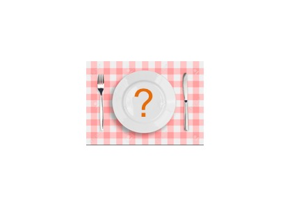</center>


--- 
## Daily Meal
<center>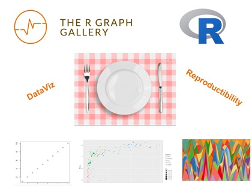</center>


---
## What is DataViz?
<p style="font-weight:bold; font-style: italic; color:grey; text-align:center;">
"<span style="font-weight:bold; color:orange;">Data visualization</span> refers to the techniques used to <span style="font-weight:bold; color:orange;">communicate data</span> or information by encoding it as visual objects (e.g., points, lines or bars) contained in <span style="font-weight:bold; color:orange;">graphics</span>."
<a href="https://en.wikipedia.org/wiki/Data_visualization" style="float: right; font-size: 14px;" >Wikipédia</a>
</p> 
<hr width="50%">

<center></center>

<p style="font-weight:bold; font-style: italic; color:grey; text-align:center;">
Data visualization is part of the <span style="font-weight:bold; color:orange;">Data Science Process</span>
</p> 

<a href="http://r4ds.had.co.nz/graphics-for-communication.html" style="float: right; font-size: 14px; text-decoration:none;" >R for data science - Garrett Grolemund & Hadley Wickham</a>


--- 
## Tools available for Datavisualization
<center>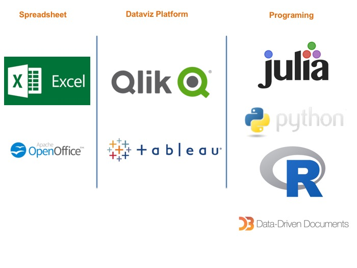</center>


--- &twocol
## About R

<hr width="50%">
<p style="font-weight:bold; font-style: italic; color:grey; text-align:center;">
"R is a <span style="font-weight:bold; color:orange;">free software</span> environment for <span style="font-weight:bold; color:orange;">statistical</span> computing and <span style="font-weight:bold; color:orange;">graphics</span>."
<a href="https://www.r-project.org/" style="float: right; font-size: 14px;" >The R Project</a>
</p> 

<center></center>


--- &twocol
## About R

<hr width="50%">
<p style="font-weight:bold; font-style: italic; color:grey; text-align:center;">
"R is a <span style="font-weight:bold; color:orange;">free software</span> environment for <span style="font-weight:bold; color:orange;">statistical</span> computing and <span style="font-weight:bold; color:orange;">graphics</span>."
<a href="https://www.r-project.org/" style="float: right; font-size: 14px;" >The R Project</a>
</p> 

<center></center>


*** =left

```r
1+1
```

```
## [1] 2
```


--- &twocol
## About R

<hr width="50%">
<p style="font-weight:bold; font-style: italic; color:grey; text-align:center;">
"R is a <span style="font-weight:bold; color:orange;">free software</span> environment for <span style="font-weight:bold; color:orange;">statistical</span> computing and <span style="font-weight:bold; color:orange;">graphics</span>."
<a href="https://www.r-project.org/" style="float: right; font-size: 14px;" >The R Project</a>
</p> 

<center></center>


*** =left

```r
1+1
```

```
## [1] 2
```

*** =right

```r
plot(1:10, 1:10)
```


---
## Why R?
<br>

- <span style="font-weight:bold; color:orange;">Ecosystem - Pipeline</span>: import / clean / transform / analyse / calculate / modelize / visualize / report
- <span style="font-weight:bold; color:orange;">Free</span> and <span style="font-weight:bold; color:orange;">Open Source</span>
- <span style="font-weight:bold; color:orange;">Reproducibility</span>: 
  - Share the data analysis process, not just the final product
  - Validation of results by others
  - Re-run analysis when data changes
  - share, edit, remix...
- <span style="font-weight:bold; color:orange;">> 10K Librairies</span>
- Very active <span style="font-weight:bold; color:orange;">community</span>
- Strong <span style="font-weight:bold; color:orange;">graphic capabilities</span>


--- &twocol
## R is groooooowing
<br>
*** =left
<center></center>
*** =right
<center></center>
<br><br><br>
<p style="text-align:right;">
<a href="http://r4stats.com/articles/popularity/" style="float: right; font-size: 14px; text-decoration:none;" >http://r4stats.com</a>
</p>


---
## Case study
<center>Imagine: you received an <span style="font-weight:bold; color:orange;">interesting dataset</span>. You have to  <span style="font-weight:bold; color:orange;">analyse it</span> and make a <span style="font-weight:bold; color:orange;">report</span> to your colleagues.<center>
<br><br><br>
<center></center>


---
## The GapMinder Dataset
Population, Life expectency and Gross Domestic Product per capita for 142 countries and 12 years.


```r
library(gapminder)
head(gapminder)
```

<a href="https://github.com/jennybc/gapminder" style="float: center; font-size: 14px; text-decoration:none;" >The Gapminder Library</a>

<iframe src="dt1.html" allowtransparency="true"> </iframe>


---
## Let's start simple


```r
data=subset(gapminder, year==2007)
plot(data$lifeExp ~ data$gdpPercap)
```


--- &twocol
## Let's improve it
Take a few minutes: what would you do to communicate this result? ...
<br>


--- &twocol
## Let's improve it
Take a few minutes: what would you do to communicate this result? ...
<br>

*** =left
* Title
* Axis names
* Shape
* Color
* Legend
*** =right
* Add information
* Interactivity
* Animation
* Reproductibility
* Share it


---
## Add title and axis names

```r
plot(data$lifeExp ~ data$gdpPercap,
     xlab="Gdp per capita", ylab="Life Expectancy",
     main="Features of countries in 2007")
```


---
## Change shapes

```r
plot(data$lifeExp ~ data$gdpPercap,
     xlab="Gdp per capita", ylab="Life Expectancy",
     main="Features of countries in 2007",
     pch=20, cex=3)
```


---
## Add colors

```r
plot(data$lifeExp ~ data$gdpPercap,
     xlab="Gdp per capita", ylab="Life Expectancy",
     main="Features of countries in 2007",
     pch=20, cex=3, col="blue")
```


--- &twocol
## About colors in R
*** =left
<br>
* <p style="color:orange; font-weight:bold;">Color names</p>
* Color number
* RGB  
* R Color Brewer

***=right


```r
plot(lifeExp ~ gdpPercap, data=data, 
     pch=20, cex=4, col="forestgreen")
```


Get all the 657 possibilities with

```r
colors()
```


--- &twocol
## About colors in R
*** =left
<br>
* Color names
* <p style="color:orange; font-weight:bold;">Color number</p>
* RGB  
* R Color Brewer

***=right

```r
plot(lifeExp ~ gdpPercap, data=data, 
     pch=20, cex=4, col=colors()[18])
```


--- &twocol
## About colors in R
*** =left
<br>
* Color names
* Color number
* <p style="color:orange; font-weight:bold;">RGB</p>
* R Color Brewer

***=right

```r
plot(lifeExp ~ gdpPercap, data=data, 
     pch=20, cex=5, col=rgb(0.2,0.3,0.8,0.4))
```


--- &twocol
## About colors in R
*** =left
<br>
* Color names
* Color number
* RGB
* <p style="color:orange; font-weight:bold;">R Color Brewer</p>

```r
library(RColorBrewer)
pal <- brewer.pal(5, "Set1")
pal
```

```
## [1] "#E41A1C" "#377EB8" "#4DAF4A" "#984EA3" "#FF7F00"
```

***=right
<center>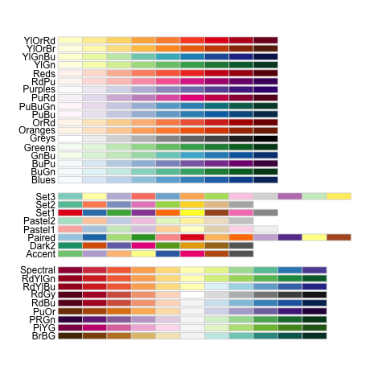</center>


---
## Map a color to a variable

```r
# attribute a color to each continent:
my_colors=pal[as.numeric(data$continent)]

# use this vector as color for the plot
plot(lifeExp ~ gdpPercap, data=data, pch=20, cex=3, col=my_colors)
```


---
## Add a legend

```r
#plot
my_colors=pal[as.numeric(data$continent)]
plot(lifeExp ~ gdpPercap, data=data, pch=20, cex=3, col=my_colors)

#add legend
legend("bottomright", legend=levels(data$continent), col=pal, pch=20, bty="n", pt.cex=3, horiz = F)
```


---
## Finally

```r
# Map the color:
library(RColorBrewer)
pal <- brewer.pal(5, "Set1")
my_colors=pal[as.numeric(data$continent)]

# Make the plot 
par(mar=c(3,3,2,2)) # Margin
plot(data$lifeExp ~ data$gdpPercap,
     
     # titles
     xlab="Gross Domestic Product per capita", ylab="Life Expectancy",
     main="Features of countries in 2007",
     
     # color
     col=my_colors,
     
     # shapes
     pch=20, cex=3,
    
     # no box:`
     bty="l")
     
#add legend
legend("bottomright", legend=levels(data$continent), col=pal, pch=20, bty="n", pt.cex=3, horiz = F)
```


---
## Getting crazy??
<center></center>


---
<br>
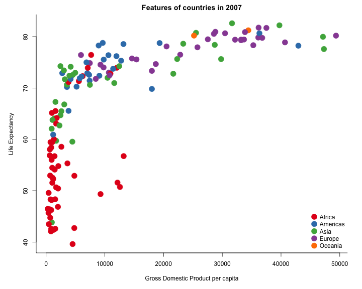


--- 
<center>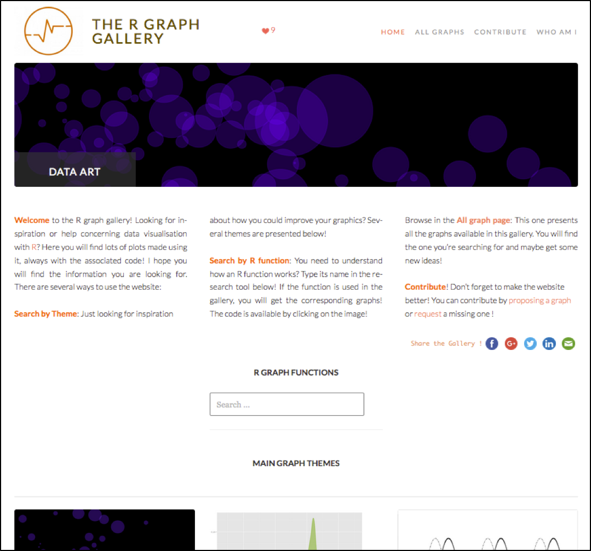</center>

<p style="font-weight:bold; font-style: italic; color:orange; text-align:center;">
"Help and Inspiration concerning R graphics"
</p> 
<p style="font-weight:bold; font-style: italic; color:grey; text-align:center;">
<a href="www.r-graph-gallery.com" style="font-size: 14px;" >www.r-graph-gallery.com</a>
</p> 


---
## Individual pages
<center>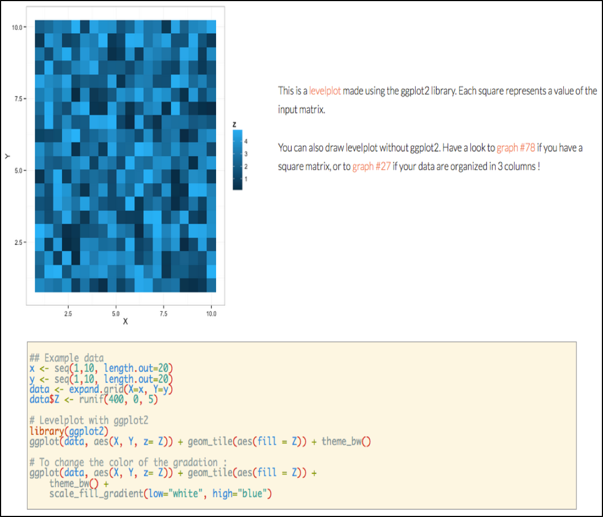</center>


---
## Portfolio pages
<center>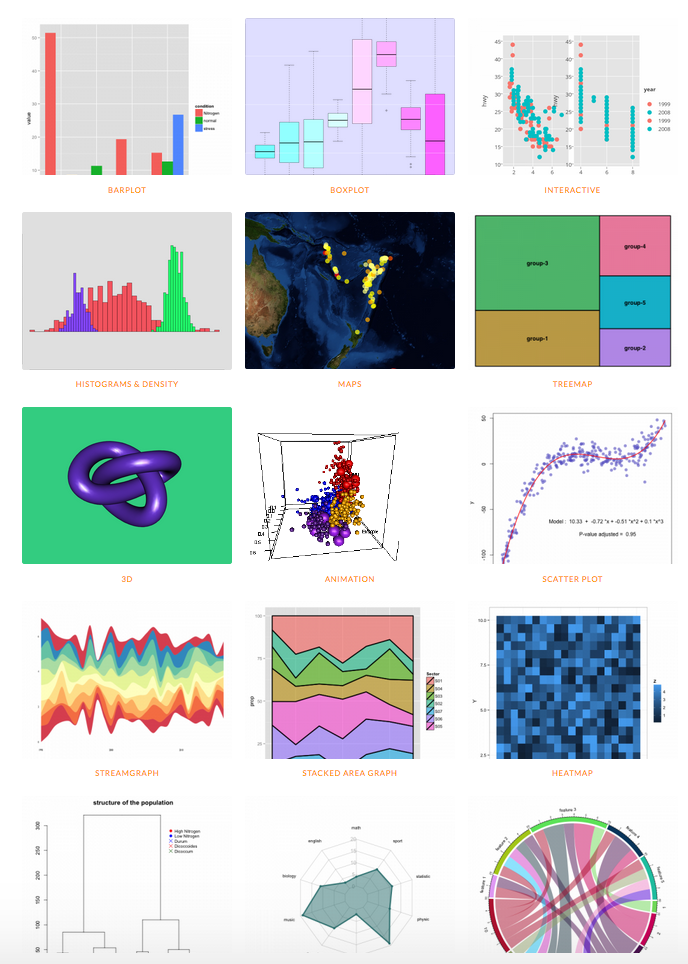</center>


---
## The Gallery needs you!
<br>
<center>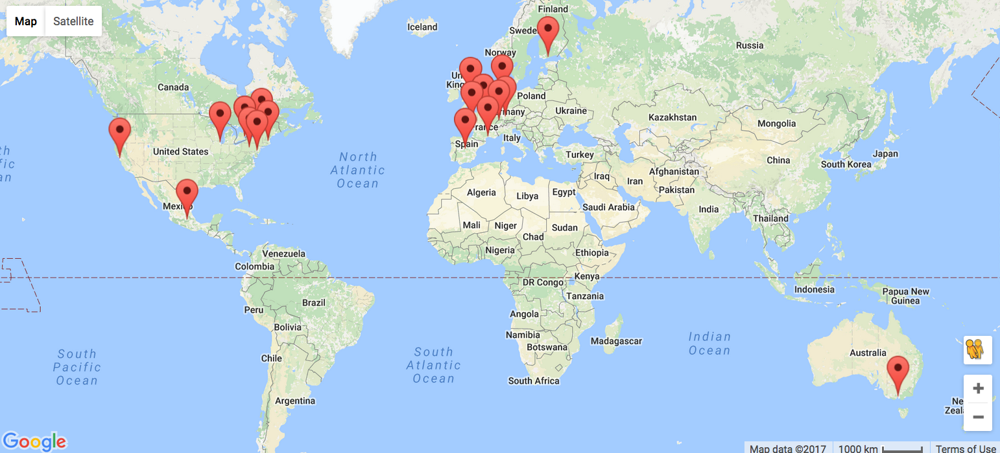</center>
<p style="text-align:center;"><a href="http://www.r-graph-gallery.com/contributors/" style="float: center; font-size: 14px;" >Propose or request a graph</a></p>


---
<br>


--- 
## The Magic of GGplot2


--- 
## The Magic of GGplot2

```r
library(ggplot2)
ggplot(data, 
  aes(gdpPercap, lifeExp, size = pop, color = continent, frame = year)) +
  geom_point()
```


---
## About GGplot2
- Created by <span style="font-weight:bold; color:orange;">Hadley Wickham</span> in 2005
- Based on Leland Wilkinson's book: <a href="http://www.springer.com/fr/book/9780387245447" style="font-size: 14px;">The Grammar of Graphics</a>
- "tries to take the good parts of base and lattice graphics and none of the bad parts" 
- 2 modes: <s>qplot()</s> and <span style="font-weight:bold; color:orange;">ggplot()</span>
<br><br>

<center>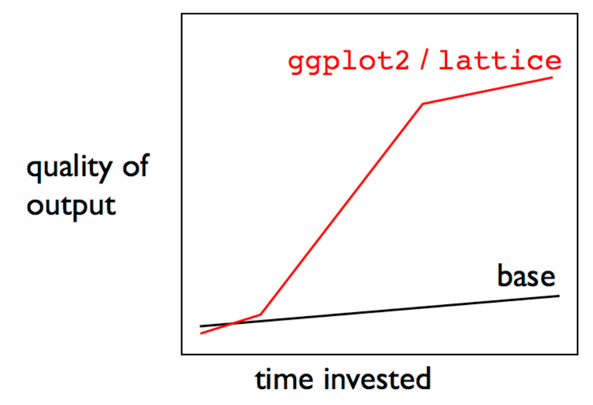</center>
<p style="text-align:center;"><a href="https://github.com/jennybc/ggplot2-tutorial/tree/master/ggplot2-tutorial-slides" style="float: center; font-size: 14px;" >Jennybc - ggplot2 tutorial</a></p>


--- &twocol
## Learning GGplot2
- The <a href="https://www.amazon.com/dp/1449316956/ref=cm_sw_su_dp?tag=ggplot2-20" style="font-size: 14px;" >R Graphics Cookbook</a> by Winston Chang
- The <a href="amzn.com/0387981403?tag=ggplot2-20" style="font-size: 14px;" >ggplot2: Elegant Graphics for Data Analysis</a> by Hadley Wickham
- Learn with examples with the <a href="http://www.r-graph-gallery.com/portfolio/ggplot2-package/" style="font-size: 14px;" >Ggplot2 section</a> of the R graph gallery
<br><br>
*** =left
<center>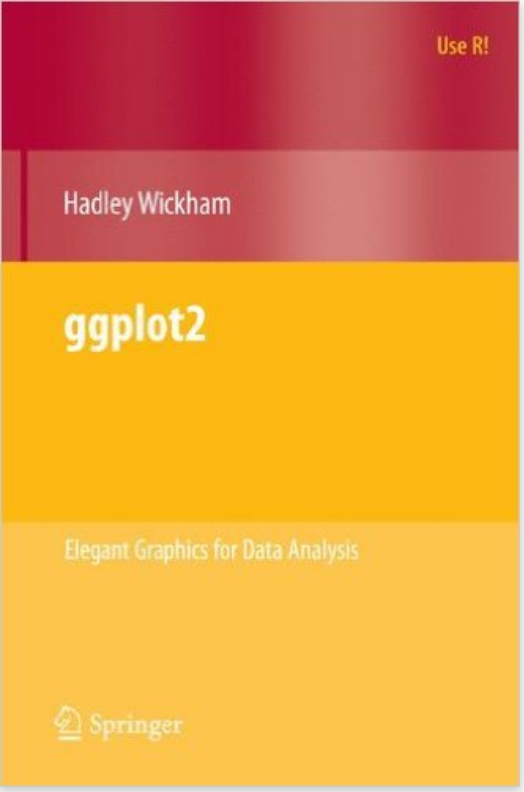</center>
*** =right
<center>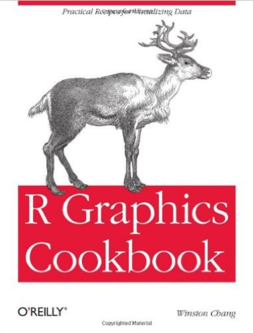</center>


--- 
## About the tidyverse
<center>"The <a href="http://tidyverse.org/" style="font-size: 14px;" >tidyverse</a>: a collection of R packages that share common philosophies and are designed to work together"</center>

<center>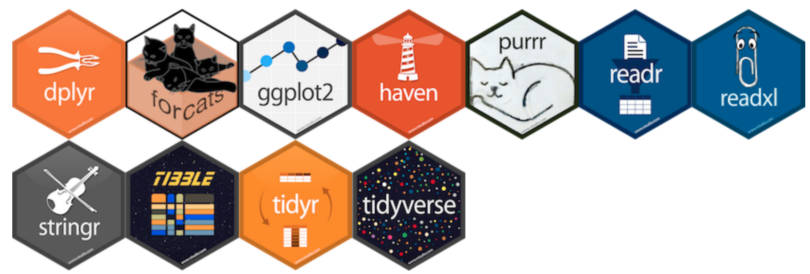</center>

<center>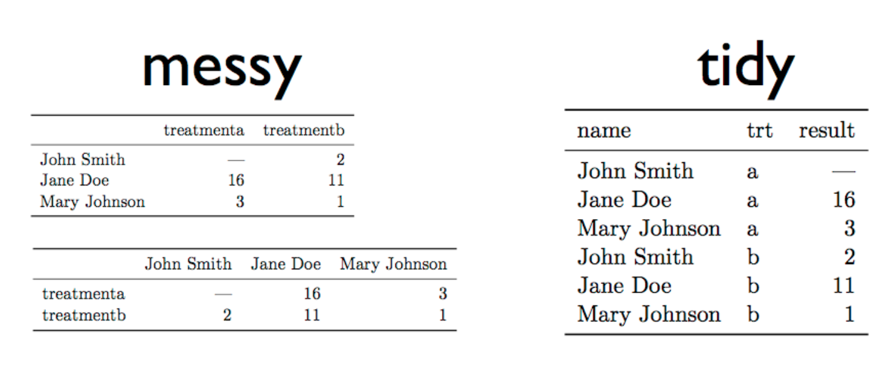</center>


--- 
## Faceting


```r
ggplot(gapminder, aes(gdpPercap, lifeExp, size = pop, color = continent, frame = year)) +
  geom_point() +
  xlim(0, 60000) +
  facet_wrap(~year)
```


---
## Faceting (again)

```r
ggplot(data, aes(gdpPercap, lifeExp, size = pop, color = continent, frame = year)) +
  geom_point() +
  xlim(0, 60000) +
  facet_wrap(~continent, nrow=3) + 
  theme(legend.position="none")
```


---
## Boxplot

```r
ggplot(gapminder, aes(x=continent, y=lifeExp, color=continent, fill=continent)) + 
  geom_boxplot(alpha=0.3)  + 
  theme(legend.position="none")
```

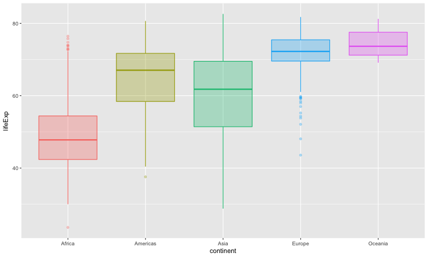

---
## Warning: always check distribution

```r
ggplot(gapminder, aes(x=continent, y=lifeExp, color=continent, fill=continent)) + 
  geom_violin(alpha=0.3)  + 
  theme(legend.position="none")
```

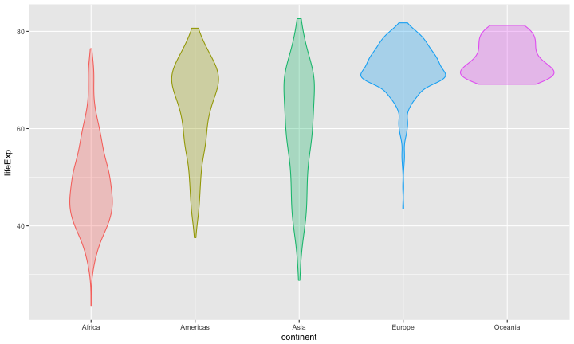


---
## Warning: always check distribution

```r
ggplot(gapminder, aes(x=continent, y=lifeExp, color=continent, fill=continent)) + 
  geom_boxplot(alpha=0.3) + 
  geom_jitter(color="grey", size=0.8) + 
  theme(legend.position="none")
```

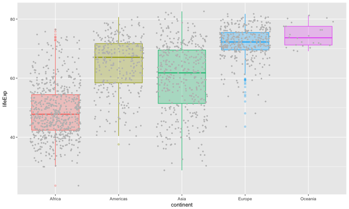

---
## With Data preparation

```r
library(dplyr)
gapminder  %>% 

	select(continent, year, pop) %>% 
	group_by(year, continent) %>% 
	summarize(sum_pop = sum(as.numeric(pop))) %>% 
	
	ggplot( aes(fill=continent, y=sum_pop, x=year)) + 
		geom_bar(stat="identity") + 
		ylab("Population per continent")
```

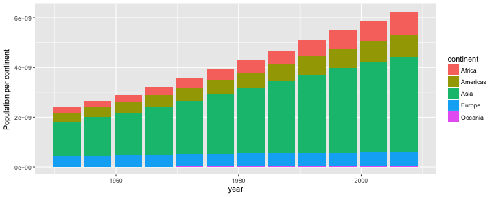


---
## With Data preparation

```r
library(dplyr)
gapminder  %>% 
	filter(continent=="Asia") %>% filter(pop > 50000000) %>%
	select(country, year, pop) %>% 
	group_by(year, country) %>% 
	ggplot( aes(x=year, y=pop, color=country, fill=country)) + 
		geom_area() +
		facet_wrap(~country)+
		theme(legend.position="none")
```

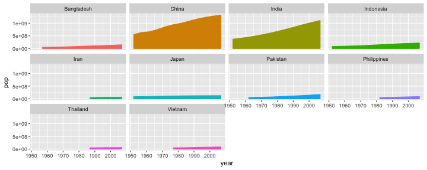


--- 
## What's next?
<br><br>


---
## Diving into Interactive charts
- <span style="font-weight:bold; color:orange;">Zoom</span> on a specific part
- Get information when <span style="font-weight:bold; color:orange;">hovering</span>
- Make groups <span style="font-weight:bold; color:orange;">appear / disappear</span>
- <span style="font-weight:bold; color:orange;">export</span> directly
- move on axis
- ... <span style="font-weight:bold; color:orange;">Play</span> with your chart
- ... Make your dataviz <span style="font-weight:bold; color:orange;">alive</span>!


---
## HTML WIDGETs
<center><b>"Bring the best of <span style="font-weight:bold; color:orange;">JavaScript</span> data visualization to <span style="font-weight:bold; color:orange;">R</span>"</b></center>

<center>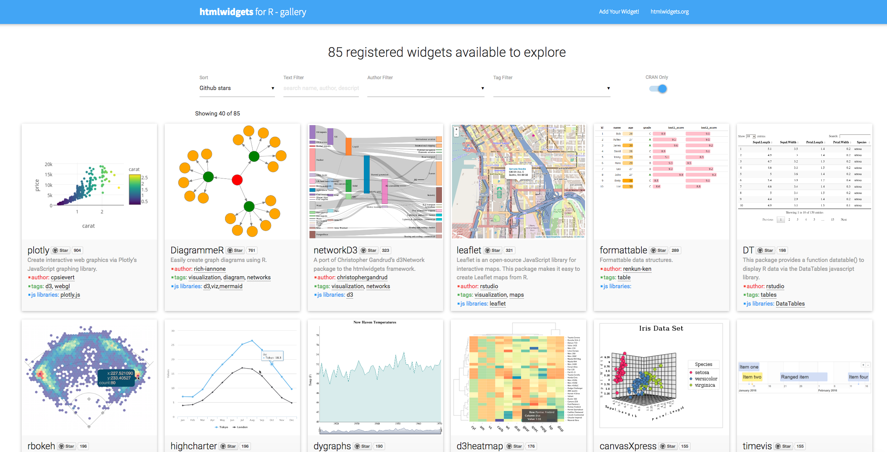</center>

<p style="text-align:center;"><a href="http://gallery.htmlwidgets.org/" style="float: center; font-size: 14px;" >The HTML Widgets for R</a></p>


---
## Plotly
<center>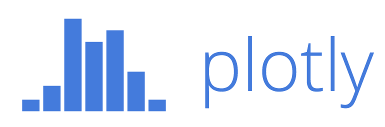</center>
- "Plotly is the modern <span style="font-weight:bold; color:orange;">platform</span> for agile business intelligence and data science"
- https://plot.ly/
- and a <span style="font-weight:bold; color:orange;">html</span> widget as well

```r
library(plotly)
```
- Make a plot with <span style="font-weight:bold; color:orange;">plot_ly()</span> or <span style="font-weight:bold; color:orange;">ggplotly()</span>


---
## Apply plotly to the gapminder dataset

```r
# Basic ggplot2 chart
p=ggplot(data, 
  aes(gdpPercap, lifeExp, size = pop, color = continent, text=country)) +
  geom_point()

# Made interactive with plotly
library(plotly)
ggplotly(p)
```

If you know ggplot2, you know how to do interactive charts!

---
## Apply plotly to the gapminder dataset


<iframe src="plotly1.html" width=100% height=500% allowtransparency="true"> </iframe>


--- 
## Leaflet


<iframe src="leaflet1.html" width=100% height=100% allowtransparency="true"> </iframe>


---
## D3network


<iframe src="D3network.html" width=100% height=500% allowtransparency="true"> </iframe>


---
## D3heatmap


<iframe src="D3heatmap.html" width=100% height=500% allowtransparency="true"> </iframe>


---
## Communicate your result


---
## Communicate your result
- <span style="font-weight:bold; color:orange;">Copy and paste</span> in powerpoint?  in an e-mail?
- Make a figure for publication with <span style="font-weight:bold; color:orange;">handmade modification</span>?
- Are you sure you can provide <span style="font-weight:bold; color:orange;">exactly the same result</span> as last time?
<br><br>

---
## Communicate your result
- <span style="font-weight:bold; color:orange;">Copy and paste</span> in powerpoint?  in an e-mail?
- Make a figure for publication with <span style="font-weight:bold; color:orange;">handmade modification</span>?
- Are you sure you can provide <span style="font-weight:bold; color:orange;">exactly the same result</span> as last time?
<br><br>
<center>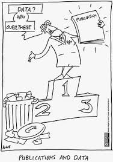</center>


---
## Most Published Research Findings Are False
<center>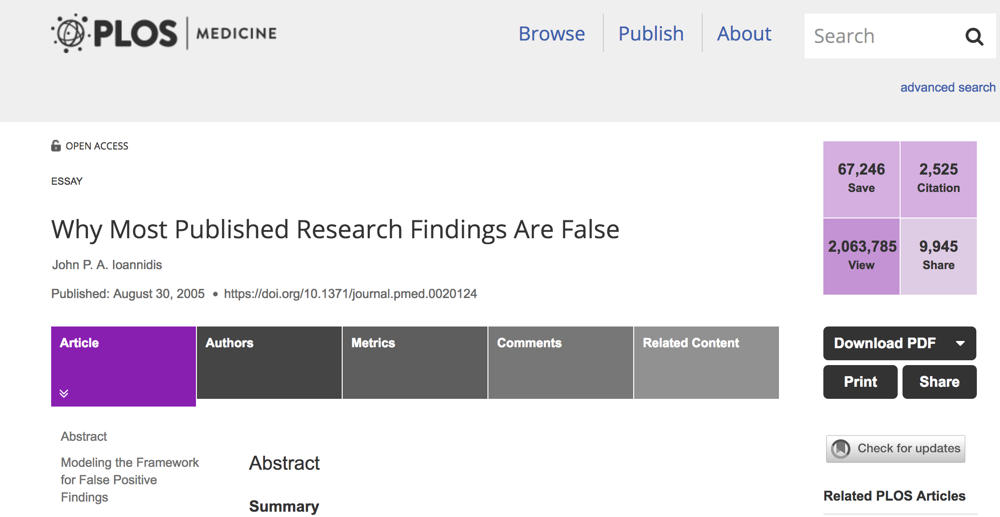</center>
<p style="text-align:center;"><a href="http://www.r-graph-gallery.com/contributors/" style="float: center; font-size: 14px;" >Plos Medicine</a></p>

<p style="text-align:center;">We need <span style="font-weight:bold; color:orange;">reproductibility</span>, And <span style="font-weight:bold; color:orange;">R</span> is the perfect tool for that.</p>


---
## Introducing RMarkDown
<br>
<center>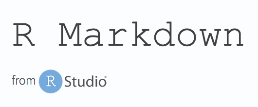</center>
<br>
- Turn your <span style="font-weight:bold; color:orange;">analysis</span> into <span style="font-weight:bold; color:orange;">reports</span>
- Fully <span style="font-weight:bold; color:orange;">reproducible</span>
- Weave together <span style="font-weight:bold; color:orange;">narrative text</span> and <span style="font-weight:bold; color:orange;">code</span>
- Many <span style="font-weight:bold; color:orange;">output formats</span>: PDF, HTML, websites...

<p style="text-align:right;"><a href="http://rmarkdown.rstudio.com/" style=font-size: 14px;" >http://rmarkdown.rstudio.com/</a></p>


---
## Header

```r
---
title: "Analysing the Gapminder dataset"
author: "Yan Holtz"
date: '`r as.character(format(Sys.Date(), format="%d/%m/%Y"))`'
output:
  html_document:
    toc: yes
---
```


---
## Title & text

```r
---
title: "Analysing the Gapminder dataset"
author: "Yan Holtz"
date: '`r as.character(format(Sys.Date(), format="%d/%m/%Y"))`'
output:
  html_document:
    toc: yes
---


# 1- Introduction
Hi Robert, here is my reproducible analysis concerning the Gapminder dataset!
```


---
## R code !

```r
---
title: "Analysing the Gapminder dataset"
author: "Yan Holtz"
date: '`r as.character(format(Sys.Date(), format="%d/%m/%Y"))`'
output:
  html_document:
    toc: yes
---


# 1- Introduction
Hi Robert, here is my reproducible analysis concerning the Gapminder dataset!


# 2- Get data
The data are included in the gapminder library
\```{r}
library(gapminder)
head(gapminder)
\```
```


---
## Basic HTML output
<center>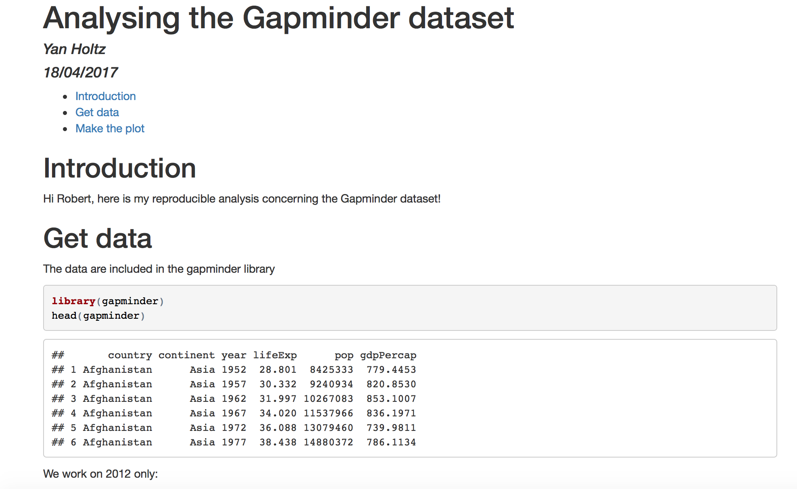</center>
<p style="text-align:center;">
<a href="http://www.r-graph-gallery.com/contributors/" style="float: center; font-size: 14px;" >See Code</a>
<a href="http://www.r-graph-gallery.com/contributors/" style="float: center; font-size: 14px;" >See HTML document</a>
</p>


---
## Pimp my RMD
<br>
<center>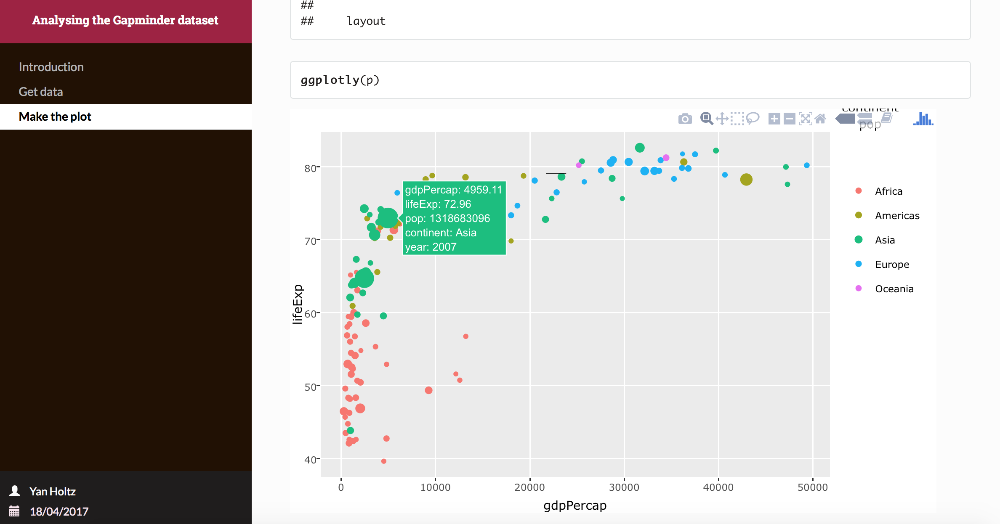</center>
<p style="text-align:center;">
<a href="http://www.r-graph-gallery.com/contributors/" style="float: center; font-size: 14px;" >See Code</a>
<a href="http://www.r-graph-gallery.com/contributors/" style="float: center; font-size: 14px;" >See HTML document</a>
</p>


---
## Introduction to shiny applications


---
## Introduction to shiny applications
<br>
<center>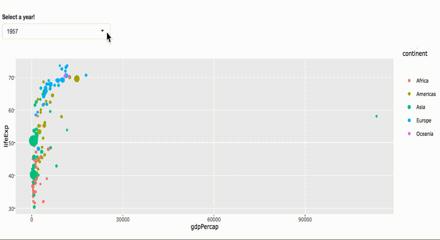</center>


---  &twocol
## Introducion to shiny applications
<center></center>

*** =left
<p style="font-weight:bold; color:orange; text-align:center;">Ui.R</p>


```r
ui <- fluidPage(
	
  # Widget to choose year
  selectInput(
    "year", "Select a year!", 
    choices=unique(gapminder$year), selected=1952
    ),
	
  # Interactive plot
  plotlyOutput("plot")
  
)
```

*** =right
<p style="font-weight:bold; color:orange; text-align:center;">Server.R</p>

```r
server <- function(input, output) {
	output$plot <- renderPlotly({
		
		# Select data
		data=subset(gapminder, year==input$year)
		
		# Make the plot
		p=ggplot(data, 
  			aes(gdpPercap, lifeExp, size = pop, 
  			    color = continent, frame = year)) +
  			geom_point()
  		ggplotly(p)
	})	
}
```


---
## Going further with Shiny

<center></center>


---
## be open-minded!
<center>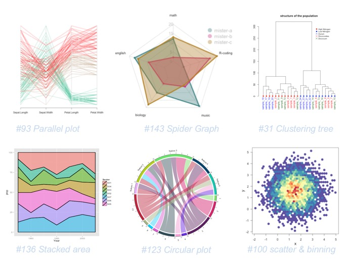</center>


---
## From Dataviz to DataArt


--- bg:black
<br>
<center></center>
<p style="text-align:center;">
<a href="http://www.r-graph-gallery.com/wp-content/uploads/2015/11/55_double_heart.png" style="float: center; font-size: 14px;" >Gaston Sanchez</a>
</p>

---
<br><br>
<center></center>
<p style="text-align:center;">
<a href="http://www.r-graph-gallery.com/188-alisa-singer-dataart/" style="float: center; font-size: 14px;" >Alisa Singer</a>
</p>

---
<br>
<br>
<br>
<center>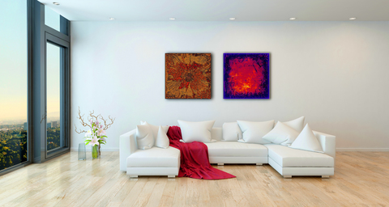</center>
<p style="text-align:center;">
<a href="http://www.r-graph-gallery.com/188-alisa-singer-dataart/" style="float: center; font-size: 14px;" >Alisa Singer</a>
</p>

---
<center></center>
<p style="text-align:center;">
<a href="http://www.r-graph-gallery.com/188-alisa-singer-dataart/" style="float: center; font-size: 14px;" >Alisa Singer</a>
</p>

---
<center></center>
<p style="text-align:center;">
<a href="http://www.r-graph-gallery.com/186-marcus-volz-dataart/" style="float: center; font-size: 14px;" >Marcus Volz</a>
</p>

---
<center></center>
<p style="text-align:center;">
<a href="http://www.r-graph-gallery.com/186-marcus-volz-dataart/" style="float: center; font-size: 14px;" >Marcus Volz</a>
</p>

---
<br>
<center></center>
<p style="text-align:center;">
<a href="http://www.r-graph-gallery.com/207-nadieh-bremer/" style="float: center; font-size: 14px;" >Alisa Singer</a>
</p>

---
<br>
<center></center>
<p style="text-align:center;">
<a href="http://www.r-graph-gallery.com/207-nadieh-bremer/" style="float: center; font-size: 14px;" >Nadieh Bremer</a>
</p>

---
<br>
<center></center>
<p style="text-align:center;">
<a href="http://www.r-graph-gallery.com/246-oliver-obrien-dataart/" style="float: center; font-size: 14px;" >Olivier O'Brien</a>
</p>

---
<br><br>
<center></center>
<p style="text-align:center;">
<a href="http://www.r-graph-gallery.com/ style="float: center; font-size: 14px;" >Yan Holtz</a>
</p>


---
<center>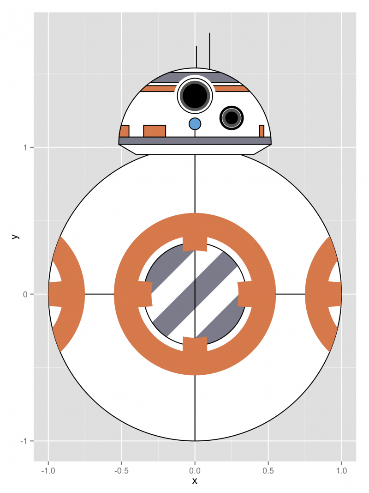</center>
<p style="text-align:center;">
<a href="http://www.r-graph-gallery.com/144-droid-bb-8-data-art/" style="float: center; font-size: 14px;" >Victor Perrier</a>
</p>


--- bg:url(assets/img/rggposter.jpeg)
<br><br><br>
<center>
<p style="border:1px solid black; padding:1%; width:600px; background-color: white">
<span style="font-weight:bold; color:orange; text-align:center;">Take Home message</span>
<br><br>
- Use <span style="font-weight:bold; color:orange;">R !</span><br>
- The <span style="font-weight:bold; color:orange;">Tidyverse</span> is your friend<br>
- <span style="font-weight:bold; color:orange;">Interactive charts</span> are just here!<br>
- Make your analysis <span style="font-weight:bold; color:orange;">reproducible</span><br>
- Explore <span style="font-weight:bold; color:orange;">new graphic methods</span><br>
<br>
</p>
</center>
<br>

<b>Yan Holtz</b>    
yan1166@hotmail.com   
<a href="holtzyan.wordpress.com">holtzyan.wordpress.com</a>   
Slide made with <a href="http://slidify.org/">Slidify</a>  
And available on <a href="github.com/holtzy">github.com/holtzy</a>  


<div style="position: absolute; left: 750px; top: 500px; z-index:100">
  </center>
</div>


